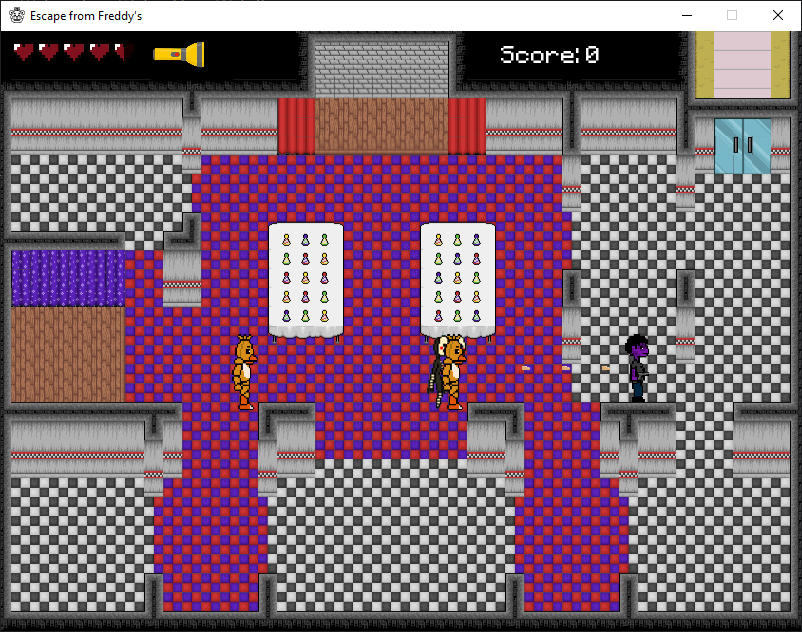

<h1>Five Nights at Freddy's arcade in Python</h1>
A game made with Python and Pygame where you control a security guard. Your mission is to kill some animatronics to escape. The game has three difficulty levels and comes with instructions, please review them before playing.

<h2>🖼️ Screenshots</h2>

  
  
  
  

<h2>🚀 Running</h2>
<h4>1. Create and activate virtual environment</h4>
<ul>
  <li>python -m venv env</li>
  <li>source env/bin/activate  #Linux/Mac</li>
  <li>env\Scripts\activate  #Windows</li>
</ul>

<h5>2. Install dependencies</h5>
<ul>
  <li>pip install -r requirements.txt</li>
</ul>

<h5>3. Run the game</h5>
<ul>
  <li>python src/main.py</li>
</ul>

<h2>🎮 Controls</h2>
<ul>
  <li>⬅️ ➡️ ⬆️ ⬇️ - Move</li>
  <li>🖱️ Left click - Shoot</li>
  <li>🖱️ Right click - Flashlight</li>
</ul>

<h2>💡 Upcoming updates</h2>
I'm currently working on a better version of the game. It will include animations, a better map, and other interactions.
